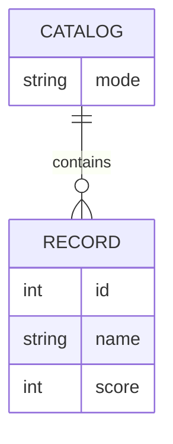

# Domain Model

Service2 holds a catalog of scored records whose contents depend on its
current mode (full or empty); Service1 reads that catalog to compute an
average.

- **Catalog** is Service2's single, current view of its data — `mode` is
either `full` (the fixed ten-record seed set) or `empty` (no records).
There is only ever one catalog in play at a time.
- **Record** — `id`, `name`, `score` — is a scored entry in the catalog. The
full-mode set is fixed seed data, reproduced verbatim in Service2's
OpenAPI contract and seed data.

