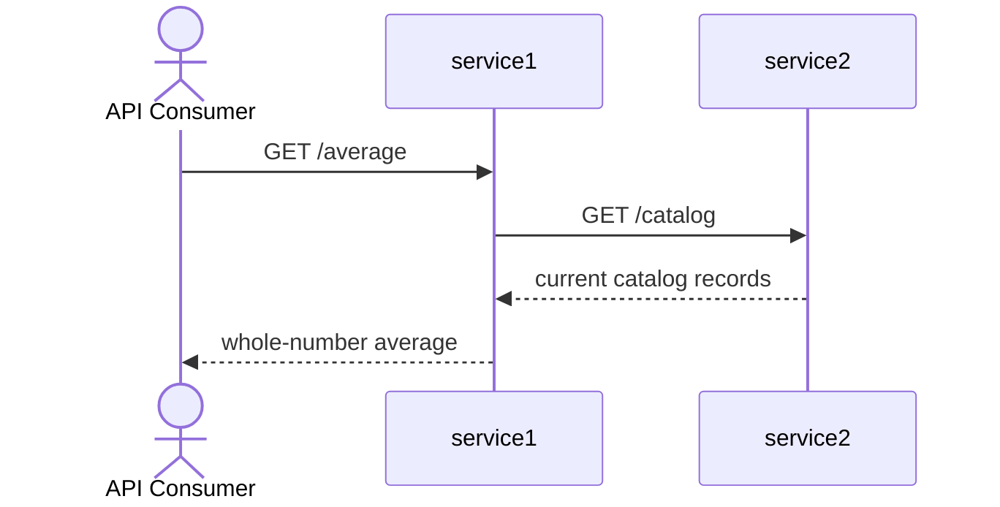

# Compute average score

An API Consumer asks Service1 for the average score; Service1 fetches
Service2's current catalog and computes the result.

```mermaid
sequenceDiagram
    actor Consumer as API Consumer
    participant service1
    participant service2

    Consumer->>service1: GET /average
    service1->>service2: GET /catalog
    service2-->>service1: current catalog records
    service1-->>Consumer: whole-number average
```

